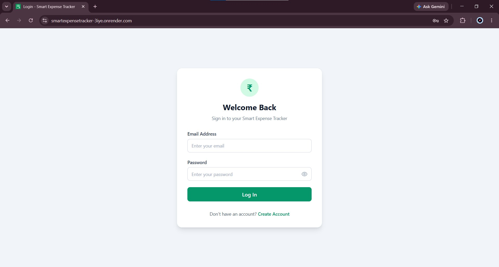
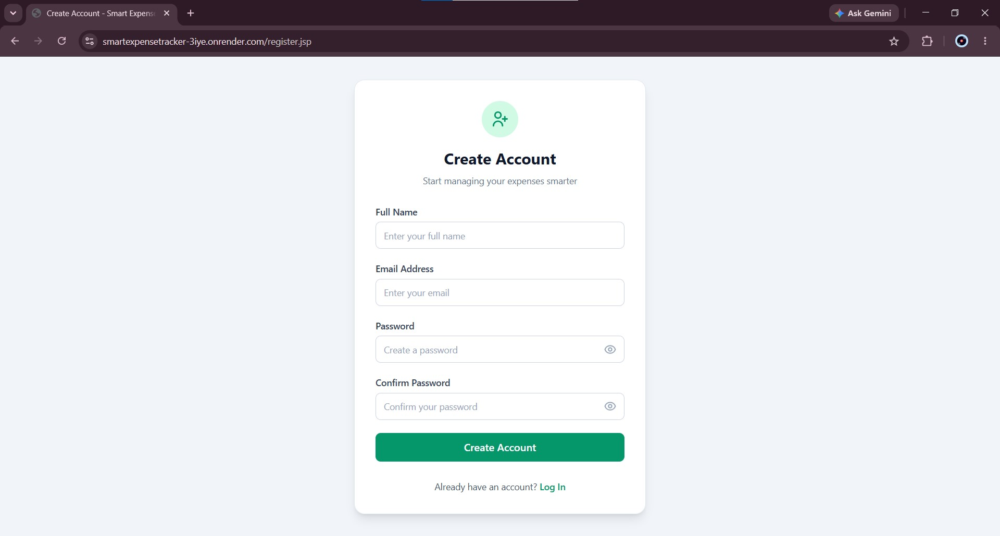
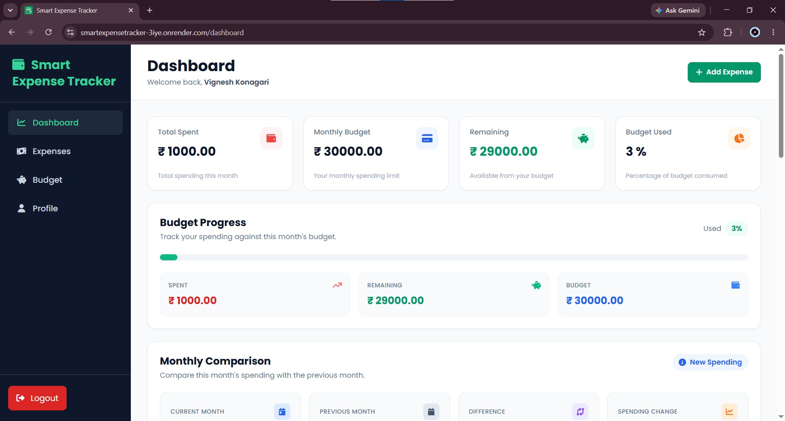
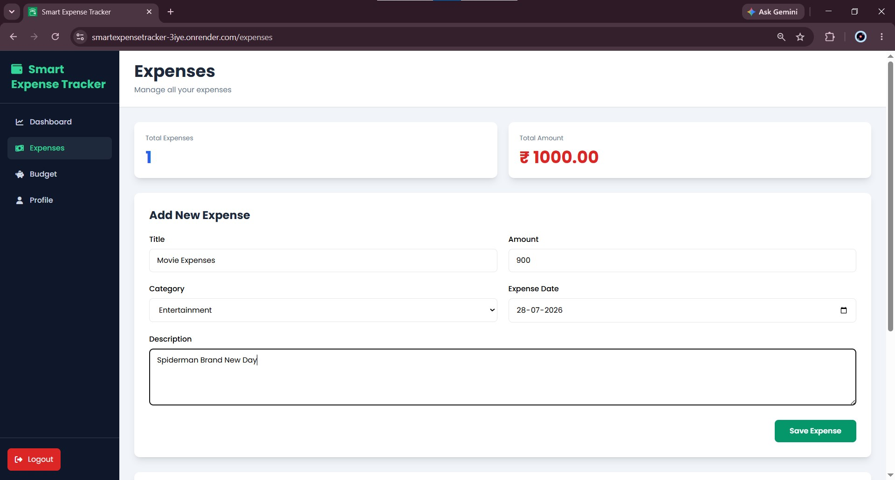
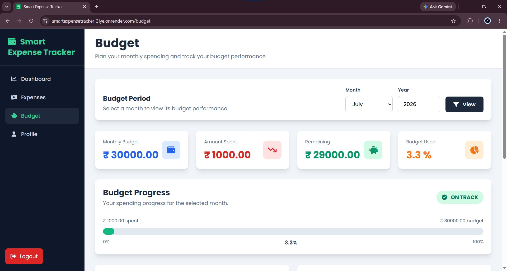
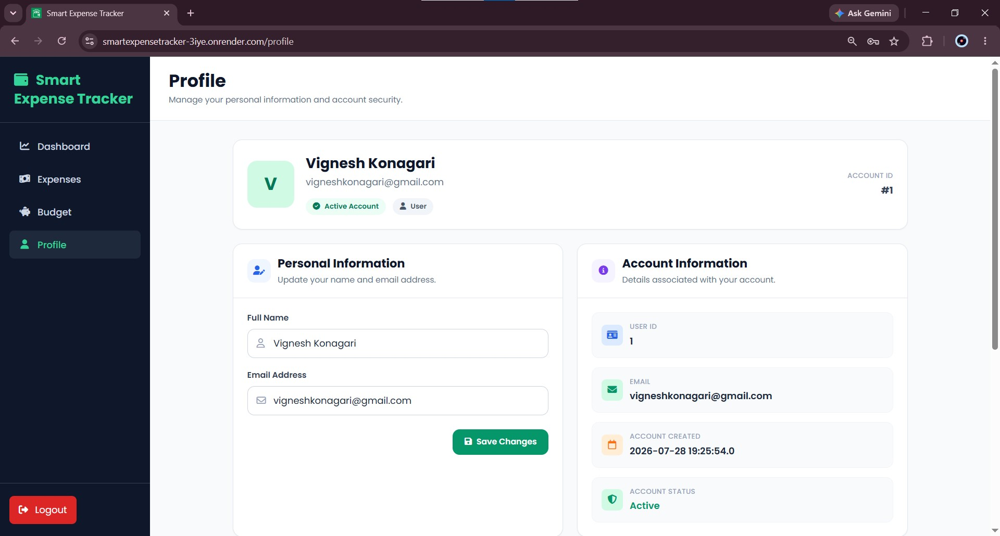

# Smart Expense Tracker

Smart Expense Tracker is a full-stack Java web application for tracking personal expenses, managing monthly budgets, and analyzing spending patterns through an interactive dashboard.

The application follows an MVC-style architecture using Jakarta Servlets, JSP/JSTL, JDBC, and MySQL. It is packaged using Maven, containerized with Docker, and deployed as a live web application with a cloud-hosted MySQL database.

## Live Demo

**Live Application:**  
https://smartexpensetracker-3iye.onrender.com

> The application is deployed on Render using Docker and Apache Tomcat, with the production MySQL database hosted on Aiven.

---

## Features

### Authentication

- User registration and login
- PBKDF2-HMAC-SHA256 password hashing
- Secure password verification
- Session-based authentication
- Protected application routes
- Secure logout
- User-specific data isolation

### Dashboard

- Monthly spending overview
- Monthly budget summary
- Remaining balance calculation
- Budget usage tracking
- Visual budget progress
- Category-wise expense visualization
- Monthly expense trends
- Recent expense activity
- Spending insights

### Expense Management

- Add new expenses
- Edit existing expenses
- Delete expenses
- View expense history
- Search expenses
- Filter expenses by category and month
- Sort expense records
- Pagination
- User-specific expense management

### Budget Management

- Set monthly budgets
- Update existing budgets
- One budget per user for each month and year
- Compare monthly spending against budget
- Calculate remaining budget
- Calculate budget usage percentage
- Visual budget progress
- Budget status indicators

### Profile

- View user profile
- Update profile information

---

## Screenshots

### Login



### Registration


### Dashboard



### Expense Management



### Budget Management



### User Profile



---

## Tech Stack

### Backend

- Java 17
- Jakarta Servlets
- JDBC
- Maven

### Frontend

- JSP
- JSTL
- HTML5
- CSS3
- JavaScript
- Tailwind CSS

### Database

- MySQL

### Application Server

- Apache Tomcat 10

### Build & Deployment

- Maven
- Docker
- Apache Tomcat
- Render
- Aiven MySQL
- Git
- GitHub

---

## Architecture

The project follows an MVC-style layered architecture.

```text
                         Browser
                            |
                            | HTTP Request
                            v
                    Servlet Controller
                       /          \
                      /            \
                     v              v
             Service / DAO       JSP View
                   |                 |
                   | JDBC            | HTML Response
                   v                 v
             MySQL Database       Browser
```

### Model

Contains Java model classes representing application data such as:

- User
- Expense
- Budget
- Dashboard statistics

### View

JSP pages are responsible for rendering the user interface and displaying data supplied by servlet controllers.

### Controller

Jakarta Servlets handle HTTP requests, validate input, interact with DAO/service classes, manage navigation, and forward data to JSP views.

### DAO Layer

DAO classes handle database operations using JDBC and prepared statements.

### Service Layer

Contains application-specific business logic such as expense analysis and spending insights.

---

## Deployment Architecture

The production application uses the following architecture:

```text
                    User Browser
                         |
                         | HTTPS
                         v
                  Render Web Service
                         |
                         v
                   Docker Container
                         |
                         v
                  Apache Tomcat 10
                         |
                         v
             Jakarta Servlet Application
                         |
                         | JDBC + SSL
                         v
                     Aiven MySQL
```

The application is built into a WAR file using Maven.

During Docker deployment, the WAR is deployed to Tomcat as:

```text
ROOT.war
```

This allows the application to be accessed directly from the root of the deployed domain.

---

## Project Structure

```text
SmartExpenseTracker/
|
|-- database/
|   `-- schema.sql
|
|-- screenshots/
|   |-- Budget.jpg
|   |-- Dashboard.jpg
|   |-- Expenses.jpg
|   |-- Login.jpg
|   |-- Profile.jpg
|   `-- Registration.jpg
|
|-- src/
|   `-- main/
|       |
|       |-- java/
|       |   `-- com/
|       |       `-- expensetracker/
|       |           |
|       |           |-- controller/
|       |           |   |-- auth/
|       |           |   |-- budget/
|       |           |   |-- dashboard/
|       |           |   |-- expense/
|       |           |   `-- profile/
|       |           |
|       |           |-- dao/
|       |           |-- filter/
|       |           |-- model/
|       |           |-- service/
|       |           `-- util/
|       |
|       `-- webapp/
|           |
|           |-- WEB-INF/
|           |   `-- views/
|           |
|           |-- css/
|           |-- js/
|           |-- login.jsp
|           `-- register.jsp
|
|-- Dockerfile
|-- pom.xml
|-- .gitignore
`-- README.md
```

---

## Database Design

The application uses three primary tables:

```text
users
expenses
budgets
```

### Users

Stores registered application users.

Important fields:

```text
user_id
name
email
password_hash
created_at
```

The email address is unique for every registered user.

Passwords are stored only as password hashes.

### Expenses

Stores expense records belonging to individual users.

Important fields:

```text
expense_id
user_id
title
amount
category
expense_date
description
created_at
updated_at
```

Each expense belongs to a user through `user_id`.

The database uses a foreign-key relationship between:

```text
expenses.user_id
        |
        v
users.user_id
```

Deleting a user automatically removes the user's associated expense records through `ON DELETE CASCADE`.

The expense amount is constrained to values greater than zero.

Indexes are provided for:

```text
user_id
expense_date
category
```

### Budgets

Stores monthly budgets belonging to individual users.

Important fields:

```text
budget_id
user_id
month
year
amount
created_at
updated_at
```

The database enforces:

```text
month BETWEEN 1 AND 12
year >= 2000
amount > 0
```

A unique constraint on:

```text
user_id + month + year
```

ensures that each user can have only one budget for a particular month and year.

---

## Security

The application includes multiple security-focused design decisions.

### Password Hashing

Passwords are hashed using:

```text
PBKDF2WithHmacSHA256
```

with:

```text
Random 16-byte salt
210,000 iterations
256-bit derived key
```

Stored passwords contain the iteration count, salt, and resulting password hash.

Plaintext passwords are never stored in the database.

### Session Authentication

After successful login, the authenticated user is stored in an HTTP session.

Protected application routes require an authenticated session.

### Authentication Filter

An authentication filter protects application functionality that requires a logged-in user.

Unauthenticated users attempting to access protected routes are redirected to the login page.

### User Data Isolation

Expense and budget operations are associated with the authenticated user's `user_id`.

Database operations use user identifiers where appropriate to ensure users can access and modify only their own records.

### SQL Injection Protection

Database operations use JDBC `PreparedStatement` parameters instead of constructing SQL queries directly from user input.

### Database Credentials

Production database credentials are supplied using environment variables.

Credentials are not hardcoded in the source code and are not committed to GitHub.

---

## Environment Variables

The application requires the following environment variables for database connectivity:

| Variable | Description |
|---|---|
| `DB_URL` | JDBC connection URL for the MySQL database |
| `DB_USERNAME` | MySQL database username |
| `DB_PASSWORD` | MySQL database password |

Example:

```text
DB_URL=jdbc:mysql://hostname:port/smart_expense_tracker?sslMode=REQUIRED
DB_USERNAME=your_database_username
DB_PASSWORD=your_database_password
```

Never commit real database credentials to the repository.

---

## Local Development Setup

### Prerequisites

Install:

- JDK 17 or later
- Apache Maven
- MySQL
- Apache Tomcat 10
- Git

MySQL Workbench can optionally be used for database administration.

### 1. Clone the Repository

```bash
git clone https://github.com/Vignesh22122/SmartExpenseTracker.git
cd SmartExpenseTracker
```

### 2. Create the Database

The database schema is available at:

```text
database/schema.sql
```

Run the script using MySQL Workbench or another MySQL client.

The script creates the database:

```text
smart_expense_tracker
```

with the tables:

```text
users
expenses
budgets
```

### 3. Configure Environment Variables

The application reads database configuration from:

```text
DB_URL
DB_USERNAME
DB_PASSWORD
```

For a local MySQL installation, the JDBC URL can look like:

```text
jdbc:mysql://localhost:3306/smart_expense_tracker
```

Configure the username and password according to your local MySQL installation.

#### Windows CMD Example

```cmd
set DB_URL=jdbc:mysql://localhost:3306/smart_expense_tracker
set DB_USERNAME=your_mysql_username
set DB_PASSWORD=your_mysql_password
```

These values apply to the current Command Prompt session.

### 4. Build the Application

From the project root:

```bash
mvn clean package
```

A successful build creates:

```text
target/SmartExpenseTracker.war
```

### 5. Deploy to Tomcat

Deploy:

```text
target/SmartExpenseTracker.war
```

to the Tomcat `webapps` directory.

Start Tomcat and open the application using the corresponding local Tomcat URL.

---

## Maven

Maven is used for:

- Dependency management
- Java compilation
- WAR packaging
- Reproducible builds

Build the application with:

```bash
mvn clean package
```

The generated WAR is:

```text
target/SmartExpenseTracker.war
```

Generated Maven files under:

```text
target/
```

are excluded from Git using `.gitignore`.

---

## Docker

The repository includes a `Dockerfile` for containerized deployment.

The Docker configuration uses a multi-stage build.

### Stage 1 - Maven Build

The Maven stage:

1. Copies the project source
2. Downloads dependencies
3. Compiles the Java application
4. Packages the application as a WAR

### Stage 2 - Tomcat Runtime

The Tomcat stage:

1. Removes the default Tomcat web applications
2. Copies the generated WAR
3. Deploys it as `ROOT.war`
4. Starts Apache Tomcat

### Build the Docker Image

```bash
docker build -t smart-expense-tracker .
```

### Run the Container

```bash
docker run -p 8080:8080 \
  -e DB_URL="your_jdbc_url" \
  -e DB_USERNAME="your_database_username" \
  -e DB_PASSWORD="your_database_password" \
  smart-expense-tracker
```

---

## Production Deployment

### Source Control

The project source code is maintained using Git and hosted on GitHub.

The production deployment uses the `main` branch.

### Application Hosting

The application is deployed as a Docker-based Web Service on Render.

The deployment process is:

```text
GitHub Repository
       |
       v
Render
       |
       v
Docker Build
       |
       v
Maven Build
       |
       v
WAR Package
       |
       v
Apache Tomcat
       |
       v
Live Web Application
```

Render builds the application directly from the repository's Dockerfile and exposes the running Tomcat application through HTTPS.

### Database Hosting

The production MySQL database is hosted on Aiven.

The deployed application connects to the cloud database through JDBC with SSL enabled.

Production database credentials are configured as environment variables on the hosting platform and are not stored in the GitHub repository.

---

## Application Workflow

```text
User
 |
 | Register / Login
 v
Authentication
 |
 v
Dashboard
 |
 +------------------+
 |                  |
 v                  v
Expenses           Budget
 |
 +-- Add
 +-- Edit
 +-- Delete
 +-- Search
 +-- Filter
 +-- Sort
 +-- Paginate
 |
 v
Dashboard Analytics
 |
 +-- Monthly spending
 +-- Category breakdown
 +-- Spending trends
 +-- Budget usage
 +-- Recent activity
```

---

## Database Relationships

```text
                users
                  |
                  | user_id
             _____|_____
            |           |
            v           v
        expenses      budgets
```

Relationships:

```text
User 1 -------- * Expenses

User 1 -------- * Budgets
```

Each expense and budget belongs to one registered user.

Foreign-key constraints maintain referential integrity between the tables.

---

## Key Technical Highlights

- Full-stack Java web application
- MVC-style layered architecture
- Jakarta Servlet-based controllers
- JSP/JSTL server-side rendering
- JDBC database connectivity
- DAO-based persistence layer
- Prepared statements for database operations
- MySQL relational database design
- Foreign-key relationships and cascading deletes
- Database constraints and indexes
- PBKDF2-HMAC-SHA256 password hashing
- Session-based authentication
- Authentication filter for protected functionality
- User-specific data isolation
- Expense CRUD operations
- Monthly budget management
- Search and filtering
- Sorting and pagination
- Dashboard analytics
- Spending insights
- Maven dependency management
- Maven WAR packaging
- Multi-stage Docker build
- Apache Tomcat deployment
- Cloud-hosted MySQL database
- Environment-based database configuration
- SSL database connectivity
- Git/GitHub version control
- Public cloud deployment

---

## Future Enhancements

Potential future improvements include:

- Recurring expense management
- Savings goals
- Custom expense categories
- Budget alerts and notifications
- Advanced spending analytics
- CSV expense export
- PDF expense reports
- REST API layer
- Unit and integration testing
- Automated CI/CD pipeline
- Improved mobile responsiveness
- Password reset functionality
- Email verification
- Multi-currency support

---

## Live Application

The deployed application is available at:

**https://smartexpensetracker-3iye.onrender.com**

---

## Repository

GitHub Repository:

**https://github.com/Vignesh22122/SmartExpenseTracker**

---

## Author

**Vignesh Konagari**

GitHub: **Vignesh22122**
